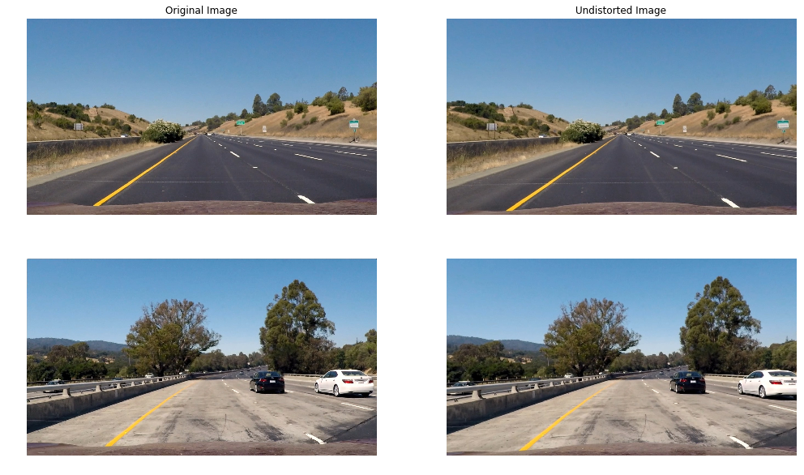
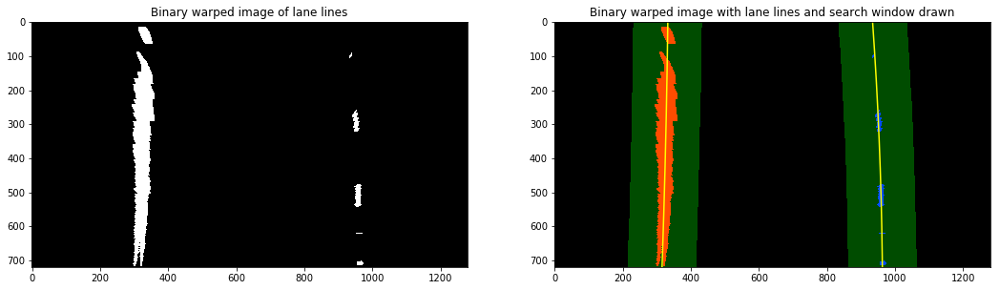

# Computer Vision for Lane Finding

In the fourth project of the [udacity self-driving car engineer course](https://eu.udacity.com/course/self-driving-car-engineer-nanodegree--nd013), I applied computer vision techniques to detect lane lines on a road captured using a camera mounted at the front of a car. The [Open Source Computer Vision Library (OpenCV)](https://opencv.org/) library was heavily utilized during this project.

The project consisted of the following stages:
1. Camera calibration to remove lens distortion effects.
2. Image pre-processing to detect lane lines.
3. Perspective transform on road to aid in detection.
4. Lane Line Detection on transformed road.
5. Vehicle position and lane radius of curvature calculation.
6. Generate video of results.

## Camera Calibration

The output from the camera is a video, which in essence is a time-series of images. Due to the nature of photographic lenses, images captured using pinhole camera models are prone to radial distortions which result in inconsistent magnification depending on the object's distance from the optical axis.

The following is an example image from [openCV](https://docs.opencv.org/2.4/modules/calib3d/doc/camera_calibration_and_3d_reconstruction.html) showcasing the two main types of radial distortions:

In order to correctly detect the lane lines in the image, we first need to correct for radial distortion.

Computer vision researchers have come up with a way to correct this radial distortion. The camera to be calibrated is used to capture images of checkerboard patterns, where all the white and black boxes in the pattern are of the same size. If the camera suffers from distortions, the captured images will incorrectly show the measurements of the checkerboard.

To correct the effects of distortion, the corners of the checkerboard are identified and deviations from the expected checkerboard measurements are used to calculate the distortion coefficients. These coefficients are then used to remove radial distortion from any image captured using that camera.

In the diagram above, the leftmost image shows the original distorted image, the rightmost image shows the corners drawn on top of the distorted image, and the middle image shows the resultant undistorted image after camera calibration.

The OpenCV functions [findChessboardCorners](https://docs.opencv.org/2.4/modules/calib3d/doc/camera_calibration_and_3d_reconstruction.html#findchessboardcorners) and [calibrateCamera](https://docs.opencv.org/2.4/modules/calib3d/doc/camera_calibration_and_3d_reconstruction.html#calibratecamera) were used to achieve the above camera calibration process.

Now that we've calibrated our camera, I tested the results on actual footage from the car video. The below image shows the result of camera calibration:

## Image Preprocessing

With the undistorted images at hand, we now return to the main objective of detecting the lane lines on the road. One way to separate and detect objects in an image is to use colour transforms and gradients to generate a filtered-down thresholded binary image. 

For color transforms, I experimented with three color spaces in order to find out which one is best at filtering the pixels representing the lane line on the road. Three colour spaces were tested:

* [HSL](https://en.wikipedia.org/wiki/HSL_and_HSV): represents colour as three channels - hue, saturation, and lightness.
* [LAB](https://en.wikipedia.org/wiki/Lab_color_space): represents colour as three channels - lightness, component a for green-red, and component b for blue-yellow.
* [LUV](https://en.wikipedia.org/wiki/CIELUV): a transformation of the XYZ colorspace that attempts [perceptual uniformity](https://en.wikipedia.org/wiki/Color_difference#Tolerance).

After some experimentation, I concluded that the **b channel** of the LAB colorspace and the **L channel** of the LUV colour space are the best combination for detecting the lane lines on the road.

The Sobel gradient filter was also considered. An image gradient measures the directional intensity of the colour change. Sobel is a type of gradient filter that uses Gaussian smoothing and differentiation operations to reduce the effects of noise.

The image above shows the original undistorted images in the first column, the b/L channel thresholding in the second column, the Sobel gradient filter in the third column, and the two filters combined in the last column.

## Perspective Transform

We can now distinguish lane lines in the image, but the task of figuring out the exact angle/direction of the lane is difficult using the default camera view. In the default camera perspective, objects further away from the camera appear smaller and the lane lines appear to converge the further they are from the car, which isn't a true representation of the real world.

One way to fix this perspective distortion is to transform the perspective of the image such that we are looking at the image from above, also known as birds-eye view.

OpenCV provides functions [getPerspectiveTransform](https://docs.opencv.org/2.4/modules/imgproc/doc/geometric_transformations.html#getperspectivetransform) and [warpPerspective](https://docs.opencv.org/2.4/modules/imgproc/doc/geometric_transformations.html#warpperspective), which can be used to apply a perspective transformation to a segment in the image. Firstly, we pick the area in the image we would like to apply the transformation to. In the image below, I've picked the lane line segment in front of the car:

Then, we choose the points representing the destination space we would like to transform the segment to, in our case any rectangle would suffice. The function will then return a 3x3 transformation matrix which can be used to warp any segment into our chosen perspective using the *warpPerspective* function.

The following image shows lanes lines from two different segments of the road with the perspective transformation successfully applied:

Notice how it is now much easier to determine the curvature of the lane line!

## Lane Line Detection

We are now finally ready to fully detect the lane lines! As a start, we apply the binary thresholding disucssed in the *Image Preprocessing* section to the perspective transformed lane line segment. We now have an image where the white pixels represent parts of the lane line we are trying to detect. 

Next, we need to find a good starting point to look for pixels belonging to the left lane line and pixels belonging to the right lane line. One approach is to generate a histogram of the lane line pixels in the image. The histogram should have two peaks each representing one of the lane lines, where the left peak is for the left lane line and the right peak is for the right lane line. The image below shows two example histograms generated from two binary images:

The locations of the two peaks are then used as a starting point to search for pixels belonging to each lane line. We employ a sliding window search technique that starts from the bottom and iteratively scans all the way to the top of the image, adding detected pixels to a list. If a sufficient number of pixels is detected in a window, the next window will be centred around their mean position, that way we are following the path of the pixels throughout the image.

After we've detected the pixels belonging to each lane line, we then fit a polynomial through the points, generating a smooth line which acts as our best approximation of where the lane line is.

The image below shows the sliding window technique in action, with the polynomial fit through the detected lane pixels (red for left lane pixels and blue for right lane pixels):

Below is another view of the sliding window search technique, with the search area highlighted and filled:

## Vehicle/Lane Position

Finally, using the location of the two detected lane lines and the assumption that the camera is located at the centre of the image, we then calculate the position of the car relative to the lane. Scale measurements to convert from pixels to meters have been calculated using the resolution of the image.

Furthermore, using the scale measurements, we can also calculate the curvature of the lane by fitting a new polynomial to the world space, then calculating the radii of curvature. The radius of curvature of the lane is then just the average of the two radii. Below image shows curve radius and centre offset for the two lane lines (detection not visible in image):

## Results

With our lane line detection pipeline complete, we now visualize our detection by projecting a filled polygon onto the video where we believe the lane line boundaries are, as per the below image:

The pipeline was run on a video of the car driving. Below is a video demonstrating the pipeline in action:

